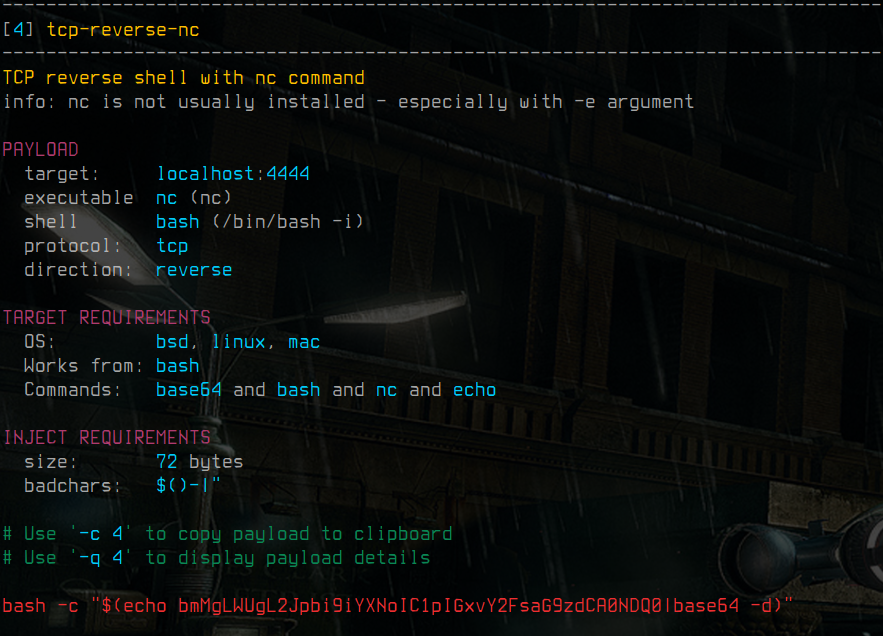

# Kusanagi - 草薙

**TL;DR:** `kusanagi` is a major, bind- and reverse shell payload generator.


[](https://github.com/psf/black)
[](https://pypi.org/project/kusanagi/)
[](https://pypi.org/project/kusanagi/)
[](https://pypi.org/project/kusanagi/)
[](https://pypi.org/project/kusanagi/)
[](https://pypi.org/project/kusanagi/)

At its core, it is just a collection of Yaml files that define various *shell commands*,
*code snippets*, *file specifications* and *obfuscators*. It combines and permutates all of them to generate
payloads according to someone's need.

**Payloads** are highly searchable and filterable in order
to generate a *code-*, *file-* or *command* injection with correct binaries for the target architecture
and removed bad chars that might get filtered/denied by certain mechanisms which are in between you and the target (e.g.: web application firewall).
Additional **output encoding** can be applied on your generated payloads (See [list of encoders](https://github.com/cytopia/kusanagi/blob/master/kusanagi/core/encoder/__init__.py#L13)).

**Disclaimer:** It does have a *copy-to-clipboard* function to eliminate heavy mouse gestures.




## :tada: Install
```bash
pip install kusanagi
```

> :exclamation: Requires Python >= 3.6


## :hourglass: Current state

[](https://github.com/cytopia/kusanagi/actions?workflow=linting)
[](https://github.com/cytopia/kusanagi/actions?workflow=building)
[](https://github.com/cytopia/kusanagi/actions?workflow=testing)

[](https://github.com/cytopia/kusanagi/actions?workflow=black)
[](https://github.com/cytopia/kusanagi/actions?workflow=mypy)
[](https://github.com/cytopia/kusanagi/actions?workflow=pylint)
[](https://github.com/cytopia/kusanagi/actions?workflow=pycode)
[](https://github.com/cytopia/kusanagi/actions?workflow=pydoc)


`kusanagi` is currently at most an alpha version and in a very early state of development.

Feel free to use it, but expect drastic changes in ui and available command line arguments.

If you want to support this project, drop me all your payloads and obfuscators you know about.


## :star: Features

You can find current features here:

* [ ] Automated Quote escaping
* [ ] Quote swapping
* [X] Obfuscation
* [ ] Permutation
* [X] Badchar elimination
* [X] Output encoder
* [X] Copy to clipboard
* [X] Command injection
* [X] Code injection
* [ ] File injection
* [ ] Payload: Persistence wrapper
* [X] Payload: reverse shell
* [ ] Payload: bind shell
* [ ] Payload: port forwarding
* [ ] BYOY: Bring your own yaml - and have custom payloads


## Usage

### General

Kusanagi is separated into different usage section. To start off, you will have to choose between a shell command for command injection (`cmd`), a code snippet from a programming language for code injection (`code`) and a generated file for various exploits injected into it (`file`).


```bash
usage: kusa <payload> [options] addr [host]
       kusa <payload> -h
       kusa -v, --version
       kusa -h, --help

Kusanagi is a bind and reverse shell payload generator with obfuscation and badchar support.

positional arguments:
  <payload>
    cmd          Generate a command to be executed on a shell.
    code         Generate source code (e.g.: php).
    file         Inject source code in a file (e.g.: php in jpeg).

misc arguments:
  -v, --version  Show version information and exit
  -h, --help     Show this help message and exit
```

### Injectable commands (`cmd`)

Options for command injection/execution module.

<details>
  <summary><strong>Click here to expand full usage</strong></summary>

```bash
usage: kusa cmd [options] addr [port]
       kusa cmd -h, --help

positional arguments:
  addr                  Address to listen or connect to.

  port                  (Optional) Port to listen or connect to
                        Default: 4444


query arguments:
  -e EXE [EXE ...], --exe EXE [EXE ...]
                        Command that will execute the payload
                        (e.g.: perl, python, php, nc, sh, bash, cmd, PowerShell, etc)
                        Default: do not filter by underlying command.

  -s SHELL [SHELL ...], --shell SHELL [SHELL ...]
                        Shell on which the command (specified via -e)
                        will be executed. Some payloads use crazy output
                        redirections or pipes that will only work on certain
                        underlying shells.
                        (e.g.: dash, sh, bash, zsh, cmd, PowerShell)
                        Default: do not filter by underlying shell.

  -b BADCHARS, --badchars BADCHARS
                        Exclude any payloads that contain the specified bad chars.
                        This comes in handy if you encounter a Web Application Firewall
                        that prohibits certain characters.
                        Default: Ignore badchars

  -o {bsd,linux,mac,solaris,windows}, --os {bsd,linux,mac,solaris,windows}
                        Only fetch payloads which work on a specific operating system.
                        Default: fetch for all OS.

  -m bytes, --maxlen bytes
                        Exclude any payloads exceeding the specified max length.


mutate arguments:
  --obf                 Run the fun. This switch will apply obfuscator to all
                        payloads to get a different set of badchars.

  --enc name [name ...]
                        Encode the output with one or more encoders.
                        When encoding multiple times, pay attention to the
                        order of specifying encoders.
                        Note that any filtering (-b, -o, etc) is not done on the
                        encoded payload. Filtering is done before.
                        To view available encoders, use --list-encoders.

helper arguments:
  -q, --quick           Show quick payload results (less detail).

  -c [index], --copy [index]
                        Copy last shown payload to clipboard or specify index
                        of payload to copy to clipboard.
                        (indices are shown in square brackets next to payload)


misc arguments:
  -h, --help            Show this help message and exit
```

</details>


#### Examples
```bash
# List reverse shells connecting to 10.0.0.1 (port 4444 by default)
kusa cmd 10.0.0.1
```
```bash
# List reverse shells connecting to 10.0.0.1:1337
kusa cmd 10.0.0.1 1337
```

```bash
# Copy last reverse shell payload to clipboard
kusa cmd 10.0.0.1 -c
```
```bash
# Copy reverse shell with index 2 to clipboard
kusa cmd 10.0.0.1 -c 2
```
```bash
# URL encode reverse shell
kusa cmd 10.0.0.1 --enc url
```
```bash
# Base64 encode and then url encode reverse shell
kusa cmd 10.0.0.1 --enc base64 url
```
```bash
# Obfuscate payloads
kusa cmd 10.0.0.1 --obf
```
```bash
# Obfuscated and filter away '/' and '$' characters in payload
kusa cmd 10.0.0.1 --obf -b '/$'
```


### Injectable code (`code`)

Options for code injection/execution module.

<details>
  <summary><strong>Click here to expand full usage</strong></summary>

```bash
usage: kusa code [options] addr [port]
       kusa code -h, --help

positional arguments:
  addr                  Address to listen or connect to.

  port                  (Optional) Port to listen or connect to
                        Default: 4444


query arguments:
  -l LANG [LANG ...], --lang LANG [LANG ...]
                        The payload language to query.
                        (e.g.: perl, python, php, etc)
                        Default: do not filter language.

  -s SHELL [SHELL ...], --shell SHELL [SHELL ...]
                        Shell on which the command (specified via -e)
                        will be executed. Some payloads use crazy output
                        redirections or pipes that will only work on certain
                        underlying shells.
                        (e.g.: dash, sh, bash, zsh, cmd, PowerShell)
                        Default: do not filter by underlying shell.

  -b BADCHARS, --badchars BADCHARS
                        Exclude any payloads that contain the specified bad chars.
                        This comes in handy if you encounter a Web Application Firewall
                        that prohibits certain characters.
                        Default: Ignore badchars

  -o {bsd,linux,mac,solaris,windows}, --os {bsd,linux,mac,solaris,windows}
                        Only fetch payloads which work on a specific operating system.
                        Default: fetch for all OS.

  -m bytes, --maxlen bytes
                        Exclude any payloads exceeding the specified max length.


mutate arguments:
  --obf                 Run the fun. This switch will apply obfuscator to all
                        payloads to get a different set of badchars.

  --enc name [name ...]
                        Encode the output with one or more encoders.
                        When encoding multiple times, pay attention to the
                        order of specifying encoders.
                        Note that any filtering (-b, -o, etc) is not done on the
                        encoded payload. Filtering is done before.
                        To view available encoders, use --list-encoders.

helper arguments:
  -q, --quick           Show quick payload results (less detail).

  -c [index], --copy [index]
                        Copy last shown payload to clipboard or specify index
                        of payload to copy to clipboard.
                        (indices are shown in square brackets next to payload)


misc arguments:
  -h, --help            Show this help message and exit

```

</details>


#### Examples
```bash
# List reverse shells connecting to 10.0.0.1 (port 4444 by default)
kusa code 10.0.0.1
```
```bash
# List reverse shells connecting to 10.0.0.1:1337
kusa code 10.0.0.1 1337
```

```bash
# Copy last reverse shell payload to clipboard
kusa code 10.0.0.1 -c
```
```bash
# Copy reverse shell with index 2 to clipboard
kusa code 10.0.0.1 -c 2
```
```bash
# Select only PHP code (-l/--language)
kusa code 10.0.0.1 -l php
```
```bash
# URL encode reverse shell
kusa code 10.0.0.1 --enc url
```
```bash
# Base64 encode and then url encode reverse shell
kusa code 10.0.0.1 --enc base64 url
```
```bash
# Obfuscate payloads
kusa code 10.0.0.1 --obf
```
```bash
# Obfuscated and filter away '/' and '$' characters in payload
kusa code 10.0.0.1 --obf -b '/$'
```


## :lock: [cytopia](https://github.com/cytopia) sec tools

Below is a list of sec tools and docs I am maintaining.

| Name                 | Category             | Language   | Description |
|----------------------|----------------------|------------|-------------|
| **[offsec]**         | Documentation        | Markdown   | Offsec checklist, tools and examples |
| **[header-fuzz]**    | Enumeration          | Bash       | Fuzz HTTP headers |
| **[smtp-user-enum]** | Enumeration          | Python 2+3 | SMTP users enumerator |
| **[urlbuster]**      | Enumeration          | Python 2+3 | Mutable web directory fuzzer |
| **[pwncat]**         | Pivoting             | Python 2+3 | Cross-platform netcat on steroids |
| **[kusanagi]**       | Payload Generator    | Python 3   | Bind- and Reverse shell payload generator |
| **[badchars]**       | Reverse Engineering  | Python 2+3 | Badchar generator |
| **[fuzza]**          | Reverse Engineering  | Python 2+3 | TCP fuzzing tool |
| **[docker-dvwa]**    | Playground           | PHP        | DVWA with local priv esc challenges |

[offsec]: https://github.com/cytopia/offsec
[header-fuzz]: https://github.com/cytopia/header-fuzz
[smtp-user-enum]: https://github.com/cytopia/smtp-user-enum
[urlbuster]: https://github.com/cytopia/urlbuster
[pwncat]: https://github.com/cytopia/pwncat
[kusanagi]: https://github.com/cytopia/kusanagi
[badchars]: https://github.com/cytopia/badchars
[fuzza]: https://github.com/cytopia/fuzza
[docker-dvwa]: https://github.com/cytopia/docker-dvwa


## :octocat: Contributing

See **[Contributing guidelines](CONTRIBUTING.md)** to help to improve this project.


## :exclamation: Disclaimer

This tool may be used for legal purposes only. Users take full responsibility for any actions performed using this tool. The author accepts no liability for damage caused by this tool. If these terms are not acceptable to you, then do not use this tool.


## :page_facing_up: License

**[MIT License](LICENSE.txt)**

Copyright (c) 2021 **[cytopia](https://github.com/cytopia)**
